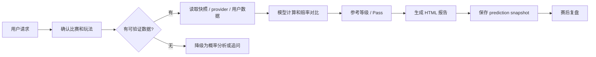

# ⚽ 足球竞彩助手

`足球竞彩助手` 是面向中文足球竞彩分析的 Codex/agent skill，包名为 `football-betting-assistant`。它用于赛前单场分析、竞彩组合、比分覆盖、大小球/总进球、胜平负/让球胜平负、串关、四串一和赛后复盘。

> ⚠️ 所有输出都必须是决策辅助，不是确定性推荐。报告可以给出“倾向”“参考购买方案”“价值不足”“Pass”，但不能使用“必中”“稳赢”“包中”“必买”“这单稳了”等确定或施压语言。

## 🗂️ 目录说明

运行时 skill 只需要 `football-betting-assistant/` 目录：

- `SKILL.md`：触发规则、默认流程、边界和路由。
- `references/`：数据源、模型参数、输出模板、术语、降级规则和回测规则。
- `schemas/`：结构化输入、快照、组合、报告和回测样本 schema。
- `scripts/`：采集、校验、模型计算、报告生成、组合构建、回测和复盘脚本。

仓库级目录用于开发和测试，不是用户使用 skill 的前置条件：

- `evals/football_betting_assistant/`：行为验收样例，用自然语言 prompt 和期望行为描述检查 skill 是否守住关键规则；不是运行时数据，也不是硬编码答案。
- `examples/football_betting_assistant/`：开发者可手动运行的标准输入样例，例如单场、组合、模型输入和回测样本。
- `tests/football_betting_assistant/`：自动化测试入口。
- `tests/fixtures/football_betting_assistant/`：测试固定数据，包括标准快照、失败快照、竞彩 raw 样本和小组赛上下文输入。它们用于离线、可重复地测试采集、校验和报告链路，不是用户模板。
- `tests/__init__.py` 和 `tests/football_betting_assistant/__init__.py`：Python 包标记文件。它们文件名相同但处在不同包层级，不是重复业务文件。

真实报告输出格式以 `references/report-templates.md` 和 HTML renderer 为准，不以 `examples/` 或 `tests/fixtures/` 为准。

## 🚀 安装和调用

把仓库中的 `football-betting-assistant/` 目录安装到 Codex 或其他 agent 的 skills 目录中。不要安装 `.agent/`、`.agents/`、`.claude/`、`.pi/` 这类本地运行态目录。

本地复制示例：

```bash
cp -R football-betting-assistant ~/.codex/skills/
```

如果这个仓库发布到你使用的 skill 安装器，也可以用对应安装命令安装；例如发布后可按安装器约定使用 `npx ...` 添加该 skill。不同 agent 的 skills 目录和安装命令可能不同，以你的 agent 文档为准。

安装后，用户提出足球投注分析、竞彩、胜平负、让球胜平负、比分推荐、大小球、总进球、串关、四串一或赛后复盘相关请求时，这个 skill 应自动触发。普通用户不需要先运行脚本，可以直接问：

```text
帮我分析北京时间明天早上四场世界杯比赛，给我一个四串一参考购买方案，重点看比分和大小球。
```

更多可复制提问模板见 [`examples/football_betting_assistant/prompts.md`](../examples/football_betting_assistant/prompts.md)。

安装后可以用这类问题确认触发：

```text
帮我看下北京时间明天的几场世界杯比赛，重点看胜平负、让球、总进球和比分。
```

中文竞彩请求默认走 `china-lottery` 模式：

1. 先检查本地 `data/football/snapshots/` 是否已有可用快照。
2. 无可用快照且本地执行可用时，运行内置 `sporttery` provider 采集公开竞彩足球快照。
3. 从快照中匹配今天、明天或用户指定的比赛。
4. 只把快照确认可买的竞彩玩法写入参考购买方案。
5. 完成赛前分析时生成自包含 HTML 报告，并保存对应 prediction snapshot 供赛后复盘。
6. 赔率、盘口或可买玩法缺失时，停止完整价值判断，只要求用户补充最少字段。

`sporttery` provider 是公开页面/公开接口的 best-effort 采集器，不是中国体育彩票官方稳定 API。它不会登录、不会绕过验证码/WAF、不会突破访问限制。页面变化或访问被拦截时，报告必须降级或追问，不能编造赔率。

## 🧭 工作流概览



## ✅ 能做什么

- 🧭 根据自然语言请求确认比赛、玩法和运行模式。
- 🔎 在工具可用时核验赛程、赔率、盘口、球队近况、伤停、首发、天气和赛事背景。
- 📊 使用透明模型做预期进球、贝叶斯式修正、泊松比分概率和赔率隐含概率对比。
- 🧾 输出单场分析、组合分析、比分覆盖、参考购买方案、HTML 报告和赛后复盘。
- 📈 对历史样本做回测，输出命中率、Brier、log loss、校准分桶和等级表现。

默认范围是成年男足俱乐部和成年男足国家队比赛。青年队、年龄组比赛和女足比赛不生成正式参考购买方案；如果被数据源采到，应标记为 `unsupported`，并按 analysis-only 或 Pass 处理。

## 🧮 数据和赔率规则

这个 skill 不会声称自己天然拥有当前盘口。赔率、盘口、首发、伤停、天气等当前数据必须来自本地快照、用户提供内容、授权数据源或公开可核验来源，并记录来源和观察时间。

只有 Sporttery 竞彩快照时，报告只能确认赛程、可买市场和已返回的赔率/盘口；它不是完整球队上下文分析。若球队近况、伤停/首发、赛程密度、战意、天气或赔率变化未核验，报告必须标明缺口并保持降级。

数据优先级：

1. 本地标准足球快照，例如 `data/football/snapshots/` 下的 JSON。
2. 中国竞彩模式下的内置 `sporttery` provider。
3. 用户提供的赔率、截图、表格、链接或结构化数据。
4. 运行环境中已配置的数据服务/API。
5. 公开网页、搜索或浏览器能核验到的公开/授权数据。
6. 无法确认时，向用户追问最少必要信息。

明确不会做的事：

- 🚫 不登录投注平台账号。
- 🚫 不绕过验证码、地区限制、频率限制或付费访问限制。
- 🚫 不硬编码投注平台账号、数据源密钥或大模型 API key。
- 🚫 没有核验来源时，不声称拥有实时赔率。

当没有从中国竞彩、用户截图/文本、授权 API、公开网页或本地快照中核验到赔率和盘口时，必须提示：

```text
竞彩赔率/盘口状态：未获取或未验证
本报告只包含概率分析，不包含赔率价值判断，不提供正式参考购买方案。
```

这种情况下可以输出赛程确认、球队背景、数据缺口、概率倾向、比分候选、大小球倾向和风险点；不能编造赔率/盘口，也不能输出“值得买”“赔率有价值”“可买方案已确认”等完整价值判断。若生成 HTML 报告，Data Status 应写为 `no-actual-odds-lines`。

## 🎛️ 运行模式

`china-lottery` 是中文竞彩、中国体育彩票、四串一、参考购买方案等语境的默认模式。购买方案只能使用已确认的中国竞彩可买市场，第三方国际赔率最多作为参考背景。

`international-odds` 只在用户明确要求海外/国际赔率时使用，例如：

```text
用 The Odds API 或海外公司赔率分析今晚西班牙 vs 沙特，重点看 h2h、spreads 和 totals 的赔率价值。
```

`analysis-only` 用于没有可验证赔率、盘口或可买玩法时的纯概率分析，例如：

```text
我不需要购买方案，也没有赔率。只看法国 vs 日本的比赛走势、比分概率和大小球倾向。
```

## 🔌 可选数据服务

这个 skill 不自带 API key。可以在 agent 运行环境中配置 MCP 工具、命令行工具、内部 HTTP 服务、本地 JSON/CSV 文件，或用户授权的第三方足球数据 API。

| 配置 / Provider | 主要用途 | 是否可替代中国竞彩赔率 |
| --- | --- | --- |
| `sporttery` | `china-lottery` 模式下默认尝试获取中国竞彩公开赛程、可买玩法、盘口和赔率。 | 是默认竞彩公开数据来源，但不是官方稳定 API。 |
| `THE_ODDS_API_KEY` | 主要用于 `international-odds` 模式；在竞彩报告里只能作为国际市场参考。 | 不能替代中国竞彩可买赔率。 |
| `API_FOOTBALL_KEY` | 补球队近期战绩、阵容、伤停、积分榜、技术统计和部分赛程/赔率背景。 | 不能替代中国竞彩可买赔率，也不是默认竞彩赔率源。 |
| `FOOTBALL_DATA_API_KEY` | 补部分赛事的赛程、赛果和积分榜。 | 不能替代中国竞彩可买赔率。 |

配置示例：

```bash
export THE_ODDS_API_KEY="your_the_odds_api_key"
export API_FOOTBALL_KEY="your_api_football_key"
export FOOTBALL_DATA_API_KEY="your_football_data_key"
```

### 🔑 API key 从哪里获取

- The Odds API：到 https://the-odds-api.com/ 注册账号，在 dashboard 里创建 API key。官方 v4 文档在 https://the-odds-api.com/liveapi/guides/v4/ 。这个 key 主要用于海外赔率、h2h/spreads/totals，以及部分 sport key 的 scores 赛果查询。
- API-Football：到 https://www.api-football.com/ 注册并订阅可用套餐，文档在 https://www.api-football.com/documentation-v3 。这个 key 适合补赛程、赛果、积分榜、阵容、伤停和球队近期数据。
- football-data.org：到 https://www.football-data.org/client/register 注册，拿到 token 后按官方 quickstart 使用 `X-Auth-Token`，文档在 https://www.football-data.org/documentation/quickstart 。这个 key 适合补部分欧洲/国际赛事的赛程、赛果和积分榜。

这些 provider 的覆盖范围、免费额度和限频会变化，README 不写死当前价格或额度。以各自官方 dashboard 和文档为准。

使用方式：

1. 在运行 Codex/agent 的 shell 里 export 这些变量，或在你自己的安全配置系统里注入同名环境变量。
2. 重新启动 agent 会话或确认运行环境能读取这些变量。
3. 用户正常提问即可；普通用户不需要手动调用 provider 脚本。

不要把真实 key 写进 `README.md`、`SKILL.md`、`references/`、仓库级 `examples/`、报告正文、issue、PR 或聊天记录。没有这些 key 时，skill 仍可尝试用 `sporttery` 快照和公开网页做中国竞彩分析；球队近期数据、阵容、积分榜和自动赛果覆盖可能降级。

### 🧩 这些 key 会被怎么用

- 赛前竞彩：`sporttery` 仍是中国竞彩可买市场的默认来源。第三方 provider 不能替代中国竞彩赔率。
- 海外赔率：`THE_ODDS_API_KEY` 可用于 `international-odds` 模式的 h2h、spreads、totals 赔率。
- 球队上下文：`API_FOOTBALL_KEY` 和 `FOOTBALL_DATA_API_KEY` 可补赛程、赛果、积分榜、近期战绩、阵容/伤停等上下文。
- 赛后复盘：自动复盘会优先用 `FOOTBALL_DATA_API_KEY`、`API_FOOTBALL_KEY`、`THE_ODDS_API_KEY` 查最终比分；都不可用时，再用用户提供数据或公开网页核验。

如果 provider 不可用、限频、无覆盖或返回冲突数据，报告会标记来源缺口并降级，而不是编造赛果、赔率或盘口。

更完整的 provider 配置示例见 [`examples/football_betting_assistant/provider-setup.md`](../examples/football_betting_assistant/provider-setup.md)。

当前实现状态：

- 已有：Sporttery 竞彩快照采集、结构化校验、xG/泊松/赔率/评级脚本、HTML 报告、prediction snapshot、赛后复盘。
- 已有：对 `API_FOOTBALL_KEY`、`FOOTBALL_DATA_API_KEY`、`THE_ODDS_API_KEY` 的用途和优先级约定。
- 尚未完整实现：赛前 API-Football / football-data.org team-context 自动采集器。没有该采集器时，agent 应通过公开网页或用户数据补上下文；补不到就明确降级。

## 📐 数学模型说明

这个 skill 使用透明、可复核的简化模型，不声称能保证赛果。完整参数在 `references/math-model.md` 和 `references/model-parameters.md`，README 只解释主流程：

1. **基础预期进球 prior xG**：优先使用双方 xG/xGA、联赛均值、主客/中立场、球队类型和近期攻防数据。没有 xG 时，可用进失球作为低精度代理，并降低置信度。
2. **贝叶斯式有界修正**：把伤停、首发、赛程密度、战意、小组出线压力、天气、盘口变化等证据作为方向性修正。修正幅度必须有上限，不能凭感觉大幅改模型。
3. **最终 xG 与泊松比分矩阵**：用 final xG 生成 0:0、1:0、1:1、2:1 等比分概率，再汇总成胜平负、大小球/总进球和比分集中区。
4. **赔率隐含概率和去水概率**：有真实赔率时，把十进制赔率转成 raw implied probability，再去除市场水位，得到更可比的市场概率。
5. **edge 和参考等级**：比较模型概率和市场概率，结合数据置信度、模型置信度、单源赔率、市场可买性、停售/开赛风险，输出 A/B/C/Pass 或降级结论。
6. **比分覆盖与组合构建**：比分不是单点确定预测，而是候选集合。高总 xG、双方都有进球路径、低数据置信度时，应扩大覆盖或降低比分票权重。

常用脚本对应关系：

- `scripts/xg_prior_calculator.py`：基础 xG prior 和有界修正。
- `scripts/poisson_calculator.py`：泊松比分矩阵、胜平负和大小球概率。
- `scripts/implied_probability.py`：赔率隐含概率和去水概率。
- `scripts/grade_calculator.py`、`scripts/market_grade_calculator.py`：edge、参考等级和降级封顶。
- `scripts/score_coverage_analyzer.py`：比分集中度与覆盖宽度。

## 🛠️ 开发者常用命令

普通用户不需要运行这些命令。它们用于开发、调试、离线复现和测试。

### 📥 数据采集和快照检查

生成当前/未来竞彩足球快照：

```bash
python3 football-betting-assistant/scripts/fetch_match_data.py \
  --mode china-lottery \
  --provider sporttery \
  --football \
  --out data/football/snapshots
```

使用 raw fixture 做离线采集调试：

```bash
python3 football-betting-assistant/scripts/fetch_match_data.py \
  --mode china-lottery \
  --provider sporttery \
  --football \
  --raw-input tests/fixtures/football_betting_assistant/raw/sporttery-football-sample.json \
  --out data/football/snapshots
```

检查快照中每场比赛哪些玩法可买、哪些缺失或不可用：

```bash
python3 football-betting-assistant/scripts/inspect_snapshot_markets.py \
  data/football/snapshots/sporttery-football-YYYYMMDDTHHMMSS+0800.json
```

按竞彩编号筛选快照比赛：

```bash
python3 football-betting-assistant/scripts/select_snapshot_matches.py \
  data/football/snapshots/sporttery-football-YYYYMMDDTHHMMSS+0800.json \
  --match-no 周四055
```

### 🧾 报告生成

从标准快照生成 HTML 报告和 prediction snapshot：

```bash
python3 football-betting-assistant/scripts/build_snapshot_report.py \
  data/football/snapshots/sporttery-football-YYYYMMDDTHHMMSS+0800.json \
  --date tomorrow \
  --competition 世界杯 \
  --topic "明天世界杯竞彩分析" \
  --report-out-dir reports/football-betting \
  --data-out-dir data/football
```

从结构化 report input 渲染 HTML：

```bash
python3 football-betting-assistant/scripts/render_html_report.py \
  path/to/report-input.json \
  --out-dir reports/football-betting
```

生成物默认不应提交：

- `reports/football-betting/*.html`
- `data/football/snapshots/*.json`
- `data/football/report-inputs/*.html-report.json`
- `data/football/predictions/*.prediction.json`
- `data/football/reviews/*.review.json`
- `data/football/competition-context/*.json`

### 🏆 小组赛上下文

从已赛比分和剩余赛程计算小组积分、出线压力、轮换风险和路线选择标记：

```bash
python3 football-betting-assistant/scripts/competition_context_calculator.py \
  tests/fixtures/football_betting_assistant/competition-context-input.json
```

把小组形势接入快照报告：

```bash
python3 football-betting-assistant/scripts/build_snapshot_report.py \
  data/football/snapshots/sporttery-football-YYYYMMDDTHHMMSS+0800.json \
  --date tomorrow \
  --competition 世界杯 \
  --competition-context data/football/competition-context/worldcup-context.json \
  --topic "明天世界杯竞彩分析" \
  --report-out-dir reports/football-betting \
  --data-out-dir data/football
```

### 🧠 模型计算

常用确定性计算脚本：

- `scripts/xg_prior_calculator.py`：计算基础 xG prior，并校验修正范围。
- `scripts/poisson_calculator.py`：计算胜平负概率、大小球概率和比分矩阵。
- `scripts/implied_probability.py`：把十进制赔率转成隐含概率和去水概率。
- `scripts/grade_calculator.py`：根据 edge、置信度和风险标记输出参考等级。
- `scripts/match_model_calculator.py`：读取单场 JSON，串联 xG、泊松、赔率去水和评级封顶。
- `scripts/market_grade_calculator.py`：按玩法分别计算 edge 和参考等级。
- `scripts/score_coverage_analyzer.py`：分析比分集中度、核心覆盖、增强覆盖和比分票适用性。
- `scripts/portfolio_builder.py`：从可买、已评级 legs 构建保守组合候选。
- `scripts/late_update_rules.py`：评估临场首发、赔率/盘口变化、停售和开赛后 stop rules。

手动计算示例：

```bash
python3 football-betting-assistant/scripts/xg_prior_calculator.py --home-xg-for 1.85 --home-xg-against 0.85 --away-xg-for 0.90 --away-xg-against 1.65 --venue-type neutral
python3 football-betting-assistant/scripts/grade_calculator.py --model-probability 0.55 --market-probability 0.52 --single-source-odds
python3 football-betting-assistant/scripts/match_model_calculator.py examples/football_betting_assistant/single-match-model-input.json
```

如果脚本不可用，agent 可以给区间或近似值，但必须标注为近似，不能伪装成精确计算。

### 🔁 回测、复盘和 smoke

回测开发样例：

```bash
python3 football-betting-assistant/scripts/validate_inputs.py examples/football_betting_assistant/backtest-sample.json
python3 football-betting-assistant/scripts/backtest_predictions.py examples/football_betting_assistant/backtest-sample.json
```

离线 smoke 测试自然语言零操作路径：

```bash
python3 football-betting-assistant/scripts/zero_operation_smoke.py \
  tests/fixtures/football_betting_assistant/football-snapshot-sporttery.json \
  --request "帮我看下北京时间明天的几场世界杯比赛" \
  --report-out-dir reports/football-betting \
  --data-out-dir data/football
```

自动赛后复盘会扫描最近 30 天的 prediction snapshot，查找已完赛比赛，抓取或读取赛果，生成结构化 review JSON 和一份中文 HTML 总复盘：

```bash
python3 football-betting-assistant/scripts/auto_post_match_review.py \
  --predictions-dir data/football/predictions \
  --review-out-dir data/football/reviews \
  --report-out-dir reports/football-betting
```

如果用户已经有赛果 JSON，可作为本地输入，适合离线复现或测试：

```bash
python3 football-betting-assistant/scripts/auto_post_match_review.py \
  --results-input path/to/match-results.json
```

赛果 JSON 最小形状：

```json
{
  "kind": "match_results",
  "data": {
    "results": [
      {
        "match": "西班牙 vs 沙特",
        "home_team": "西班牙",
        "away_team": "沙特",
        "competition": "世界杯",
        "kickoff_time": "2026-06-26T03:00:00+08:00",
        "home_goals": 2,
        "away_goals": 0,
        "source": "user-provided"
      }
    ]
  }
}
```

低层单场复盘仍可直接使用 `scripts/post_match_review.py` 给已有 prediction snapshot 附加赛果。普通“赛后复盘”请求应优先走自动复盘入口。不要把赛后事实回填进原始赛前预测。

## 📤 输出要求

输出必须区分“概率分析”和“可买方案”。如果用户截图或数据源里某场没有普通胜平负，只显示让球胜平负、比分、总进球或大小球，则购买方案不得写普通胜平负。

单场报告通常包含：数据来源与比赛确认、基础面、盘口赔率、模型记录、概率判断、比分候选、参考购买方案和风险点。

多场串关报告默认用“经理人详版”：先给北京时间比赛清单和全场次结论，再给赛制/小组背景、数据来源、玩法可买性、逐场分析、比分覆盖和组合候选。6、8、10 场或更多比赛也要逐场分析，不因出票限制省略比赛。

组合金额必须按注数计算，例如 `2 x 2 x 2 x 2 = 16 注`，默认 `16 注 x 2 元/注 = 32 元`；不要固定套用 `2/16/32/48 元` 档位。

常见组合候选包括 `模型最稳主单`、`让球/胜平负方向单`、`大小球/总进球单`、`比分4串1`、比分覆盖、`混合过关单`、`备选/替换` 和 `可选小组合`。精确比分串关最多 4 场；胜平负/让球胜平负最多 8 场；大小球/总进球最多 8 场。模型可以少选，不强行凑满。

完成赛前单场或多场分析时，默认生成一个自包含 HTML 报告到 `reports/football-betting/`，并在聊天里只返回 2-4 行摘要、HTML 路径和 prediction snapshot 路径。除非用户明确要求，不生成 Markdown 报告。

## ✅ 本地校验

校验最小开发样例：

```bash
python3 football-betting-assistant/scripts/validate_inputs.py examples/football_betting_assistant/single-match-input.json
python3 football-betting-assistant/scripts/validate_inputs.py examples/football_betting_assistant/portfolio-input.json
python3 football-betting-assistant/scripts/validate_inputs.py examples/football_betting_assistant/backtest-sample.json
```

运行 contract tests：

```bash
python3 -m unittest tests.football_betting_assistant.test_snapshot_contract
```
